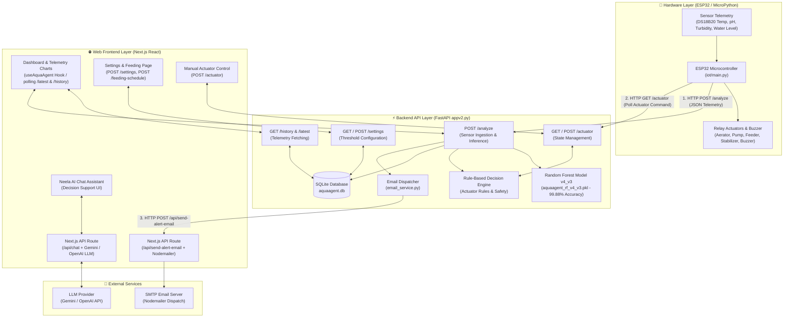
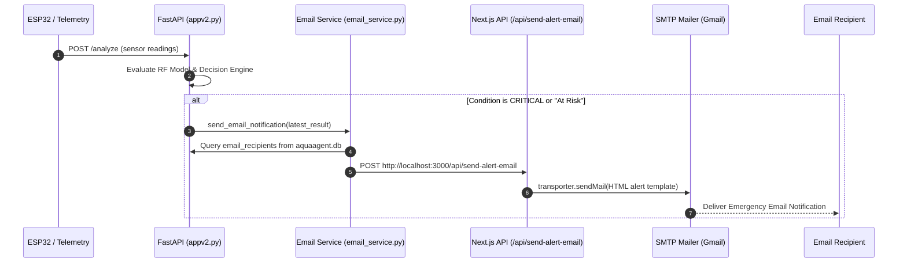

# 🏗️ Arsitektur Sistem AQUAAGENT (NEELA AI)

Dokumen ini menjelaskan arsitektur keseluruhan sistem **AQUAAGENT (NEELA AI)**, mencakup alur komunikasi antara **Web Frontend (Next.js)**, **Backend API (`appv2.py` FastAPI)**, **IoT Hardware Node (`iot/main.py` ESP32)**, **Random Forest Machine Learning Classifier**, **Rule-Based Decision Engine**, serta **Sistem Notifikasi & Decision Support System (LLM)**.

---

## 📊 Diagram Arsitektur Sistem

---

## 🧩 Penjelasan Komponen Arsitektur & Alur Komunikasi

### 1. 🔌 Hardware Layer (`iot/main.py` — ESP32 MicroPython)
* **Peran:** Mengumpulkan data telemetri sensor fisik air kolam secara *real-time* dan mengendalikan saklar relay aktuator fisik.
* **Komponen Sensor:**
  * DS18B20 (Suhu Air °C)
  * Gravity Analog pH Sensor V2 (pH)
  * SEN0189 Optical Sensor (Kekeruhan / Turbidity NTU)
  * Resistive Water Level Sensor (Ketinggian Air cm)
* **Komponen Aktuator (Active LOW Relay):**
  * Aerator Air Pump (Relay 1)
  * Water Circulation Pump (Relay 2)
  * Auto Feeder Motor/Servo (Relay 3)
  * pH Neutralizer Dosing Pump (Relay 4)
  * Active Buzzer Alarm (Pin 27)
* **Alur Kerja Main Loop (`main.py`):**
  1. Membaca telemetri sensor setiap interval `REFRESH_INTERVAL` (default: 5 detik).
  2. Mengirimkan JSON data sensor ke Backend API melalui request `HTTP POST http://<SERVER_IP>:8000/analyze`.
  3. Mengambil status perintah aktuator terbaru dari Backend API melalui request `HTTP GET http://<SERVER_IP>:8000/actuator`.
  4. Menyetel status relay fisik (Active LOW: ON = 0, OFF = 1) dan buzzer sesuai instruksi backend.

---

### 2. ⚡ Backend Core API (`backend-neela-ai/appv2.py` — FastAPI)
Backend adalah pusat kecerdasan sistem yang menggabungkan Machine Learning, Rule-Based Actuation, dan penyimpanan database.

* **A. Data Ingestion & Feature Engineering (`/analyze`):**
  * Menerima payload data dari ESP32 atau Web Simulator.
  * Mengestimasi nilai *Dissolved Oxygen (DO)* berdasarkan suhu air dengan formula empiris jika sensor DO fisik tidak ada.
  * Melakukan *feature engineering* otomatis (`risk_flag`, deviasi pH/Suhu/Turbiditas/DO, rasio antar variabel, dan encoding siklis jam `hour_sin` / `hour_cos`).
* **B. Random Forest Inference Engine (`aquaagent_rf_v4_v3.pkl`):**
  * Memprediksi kondisi kesehatan ikan/kolam secara presisi menjadi **"Stable"** atau **"At Risk"** dengan tingkat akurasi 99.88%.
* **C. Rule-Based Decision Engine:**
  * Mengevaluasi kondisi parameter terhadap ambang batas (*threshold*) dari konfigurasi `settings`:
    * `DO < doThreshold` ➡️ Turn ON Aerator.
    * `Temperature > tempMax` OR `Turbidity > turbidityMax` ➡️ Turn ON Water Circulation Pump.
    * `pH < phMin` OR `pH > phMax` ➡️ Turn ON pH Neutralizer Pump.
    * `Water Level > waterLevelMax` OR `Health Status == "At Risk"` ➡️ Turn ON Emergency Buzzer.
  * Jika aktuator dalam mode `AUTONOMOUS`, *state* aktuator global akan otomatis diperbarui.
* **D. Database Persistence (`aquaagent.db` - SQLite3):**
  * Tabel `history`: Menyimpan riwayat telemetri sensor, timestamp, dan status kesehatan.
  * Tabel `settings`: Menyimpan ambang batas parameter & status IoT receiver.
  * Tabel `feeding_schedule`: Menyimpan jadwal & interval otomatis pemberian pakan.
  * Tabel `email_recipients`: Menyimpan daftar email penerima notifikasi darurat.

---

### 3. 🌐 Frontend Web Application (Next.js React)
Web Frontend memberikan antarmuka pemantauan interaktif, kontrol manual, visualisasi grafik, dan manajemen konfigurasi.

* **A. Real-Time Telemetry Polling (`src/hooks/useAquaAgent.js`):**
  * Custom hook yang secara otomatis melakukan polling periodik ke `GET /latest` dan `GET /history` pada FastAPI backend untuk memperbarui dashboard secara *real-time*.
* **B. Manual & Autonomous Actuator Control (`src/pages/actuator.js`):**
  * Memungkinkan pengguna beralih antara mode `AUTONOMOUS` dan `MANUAL`, serta mengontrol relay aktuator secara manual via `POST /actuator`.
* **C. Konfigurasi Threshold & Pakan (`src/pages/settings.js`):**
  * Memperbarui batas aman sensor dan interval polling melalui `POST /settings` dan `POST /feeding-schedule`.

---

## 📩 Sistem Notifikasi Email Darurat

---

## 🤖 Decision Support System / Neela AI Chat (LLM Integration)

Aplikasi dilengkapi asisten AI interaktif untuk pengelola kolam:
1. User mengajukan pertanyaan di halaman Web Chat (`src/pages/chat.js`).
2. Frontend mengambil *telemetry context* terkini dari hook `useAquaAgent`.
3. Request dikirim ke Next.js API Route (`src/pages/api/chat.js`).
4. API Route menggabungkan *System Prompt* khusus budidaya ikan Nila + data telemetri real-time, lalu mengirimnya ke **Gemini API** / **OpenAI API**.
5. AI memberikan rekomendasi penanganan, mitigasi risiko, dan penjelasan ilmiah berbasis kondisi riil kolam saat itu.

---

## 📝 Kesimpulan Ringkasan Endpoints Backend

| Endpoint | Method | Fungsi Komunikasi |
|----------|--------|-------------------|
| `/` | GET | Health check status server backend |
| `/analyze` | POST | Menerima telemetri ESP32, jalankan RF Model & Decision Engine |
| `/actuator` | GET / POST | Membaca / Memperbarui status relay aktuator |
| `/beep/ack` | POST | Mengonfirmasi & mematikan alarm buzzer |
| `/feeder/ack` | POST | Mengonfirmasi proses pakan selesai |
| `/actuator/ack` | POST | Mengatur ulang aktuator spesifik |
| `/settings` | GET / POST | Membaca & menyimpan konfigurasi threshold sistem |
| `/feeding-schedule` | GET / POST | Membaca & menyimpan jadwal pakan otomatis |
| `/feeding-version` | GET | Sinkronisasi versi jadwal pakan dengan ESP32 |
| `/emails` | GET / POST | Mengelola daftar email notifikasi |
| `/emails/{email}` | DELETE | Menghapus alamat email dari daftar notifikasi |
| `/latest` | GET | Mengambil hasil analisis telemetri terbaru |
| `/history` | GET | Mengambil riwayat telemetri dari database |
