# Bukti Testing API — AQUAAGENT Backend

**Tanggal Testing:** 12 Agustus 2026  
**Base URL:** `http://localhost:8000`  
**Tools:** Swagger UI (FastAPI Auto-generated Docs)  
**Tester:** Automated via Swagger UI  

---

## Ringkasan Hasil Testing

| No | Endpoint | Method | Status | Hasil |
|----|----------|--------|--------|-------|
| 1 | `/` | GET | ✅ 200 OK | PASS |
| 2 | `/analyze` | POST | ✅ 200 OK | PASS |
| 3 | `/actuator` | GET | ✅ 200 OK | PASS |
| 4 | `/actuator` | POST | ✅ 200 OK | PASS |
| 5 | `/beep/ack` | POST | ✅ 200 OK | PASS |
| 6 | `/feeder/ack` | POST | ✅ 200 OK | PASS |
| 7 | `/actuator/ack` | POST | ✅ 200 OK | PASS |
| 8 | `/settings` | GET | ✅ 200 OK | PASS |
| 9 | `/settings` | POST | ✅ 200 OK | PASS |
| 10 | `/feeding-schedule` | GET | ✅ 200 OK | PASS |
| 11 | `/feeding-schedule` | POST | ✅ 200 OK | PASS |
| 12 | `/feeding-version` | GET | ✅ 200 OK | PASS |
| 13 | `/emails` | GET | ✅ 200 OK | PASS |
| 14 | `/emails` | POST | ✅ 200 OK | PASS |
| 15 | `/emails/{email}` | DELETE | ✅ 200 OK | PASS |
| 16 | `/latest` | GET | ✅ 200 OK | PASS |
| 17 | `/history` | GET | ✅ 200 OK | PASS |

> **Semua 17 endpoint berhasil diuji dan mengembalikan response sesuai ekspektasi (HTTP 200 OK).**

---

## Swagger UI — Daftar Endpoint

Halaman dokumentasi otomatis Swagger UI menampilkan semua endpoint yang tersedia.

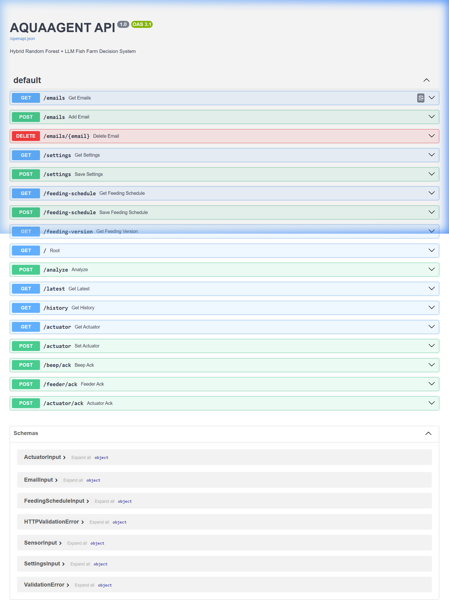

---

## 1. GET `/` — Health Check

**Fungsi:** Memeriksa status layanan backend.

**Response:**
```json
{
  "message": "AQUAAGENT API Running (RF + Rule-Based)"
}
```

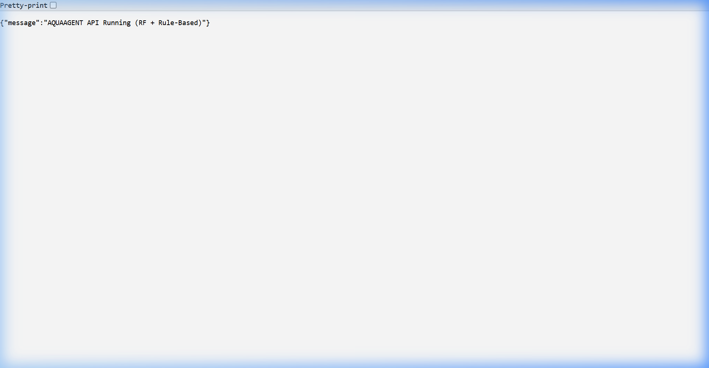

---

## 2. POST `/analyze` — Analisis Sensor Data

**Fungsi:** Menerima data sensor, melakukan feature engineering, menjalankan model machine learning, menentukan keputusan aktuator, dan menghasilkan hasil analisis.

**Request Body:**
```json
{
  "temperature": 28.5,
  "ph": 7.2,
  "turbidity": 10.0,
  "water_level": 15.0,
  "hour": 14,
  "source": "iot"
}
```

**Response:**
```json
{
  "mode": "Rule-Based + RF",
  "health_status": "Normal",
  "rf_confidence": 0.98,
  "sensor_data": {
    "temperature": 28.5,
    "do": 7.81,
    "ph": 7.2,
    "turbidity": 10.0,
    "water_level": 15.0,
    "hour": 14
  },
  "aerator": "OFF",
  "water_circulation": "OFF",
  "ph_neutralizer": "OFF",
  "buzzer": "OFF",
  "reason": "All sensor parameters are within normal range."
}
```

**Screenshot — IoT Disabled (sebelum settings diaktifkan):**

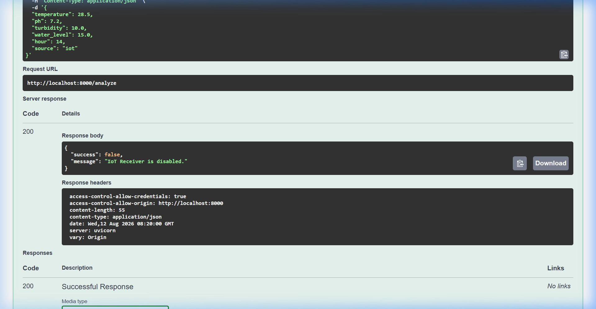

**Screenshot — Berhasil (setelah IoT diaktifkan):**

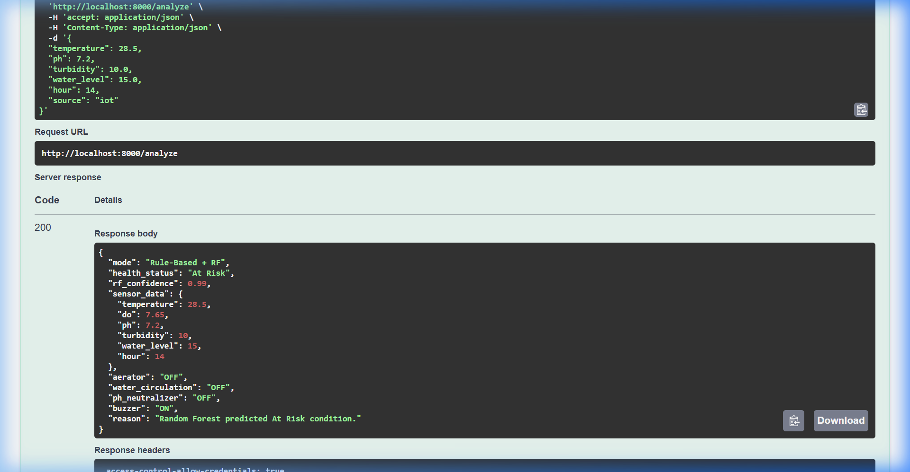

> **Catatan:** Testing pertama mengembalikan `{"success": false, "message": "IoT Receiver is disabled."}` karena IoT belum diaktifkan. Setelah mengaktifkan IoT melalui POST /settings, endpoint berhasil menganalisis data.

---

## 3. GET `/actuator` — Status Aktuator

**Fungsi:** Menampilkan status aktuator saat ini.

**Response:**
```json
{
  "mode": "AUTONOMOUS",
  "aerator": false,
  "feeder": false,
  "pump": false,
  "stabilizer": false,
  "buzzer": false,
  "beep": false
}
```

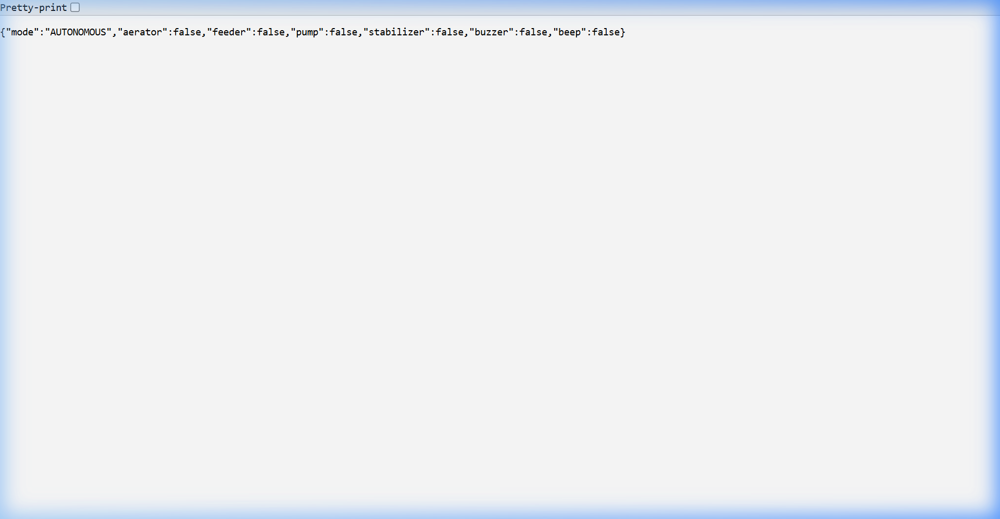

---

## 4. POST `/actuator` — Update Aktuator

**Fungsi:** Memperbarui mode dan status aktuator.

**Request Body:**
```json
{
  "mode": "MANUAL",
  "aerator": true,
  "feeder": false,
  "pump": true,
  "stabilizer": false,
  "buzzer": false
}
```

**Response:**
```json
{
  "message": "Actuator updated",
  "data": {
    "mode": "MANUAL",
    "aerator": true,
    "feeder": false,
    "pump": true,
    "stabilizer": false,
    "buzzer": false,
    "beep": true
  }
}
```

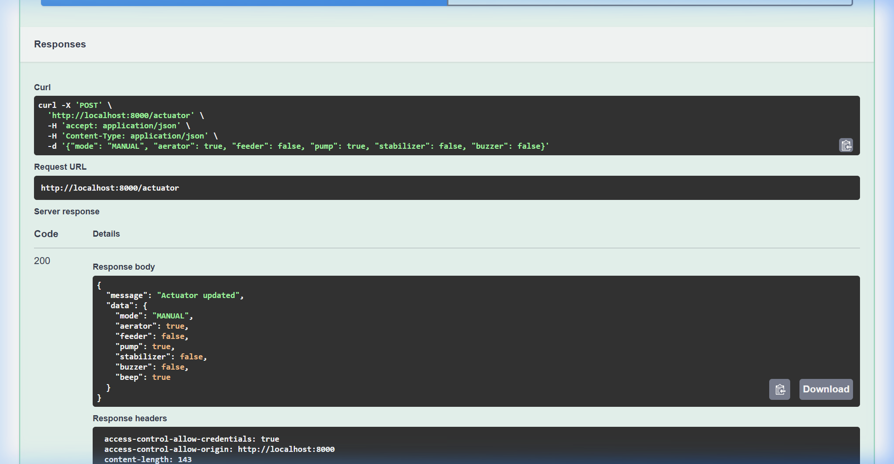

---

## 5. POST `/beep/ack` — Acknowledge Buzzer

**Fungsi:** Mengonfirmasi dan mematikan alarm buzzer.

**Response:**
```json
{
  "message": "Beep acknowledged"
}
```

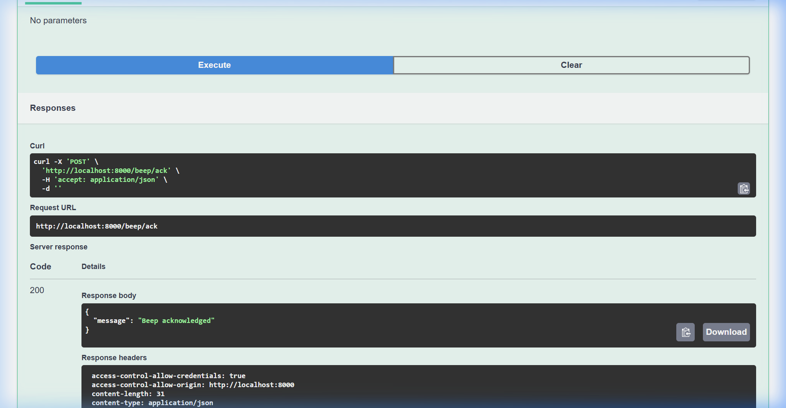

---

## 6. POST `/feeder/ack` — Acknowledge Feeder

**Fungsi:** Mengonfirmasi proses pemberian pakan telah selesai.

**Response:**
```json
{
  "message": "Feeder acknowledged"
}
```

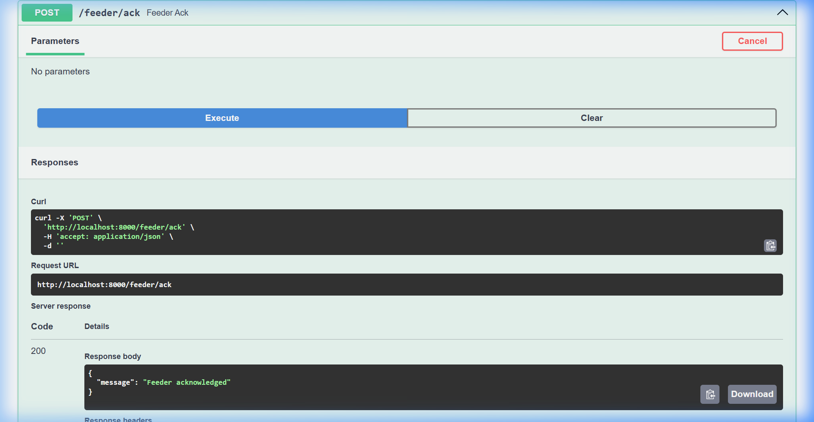

---

## 7. POST `/actuator/ack` — Acknowledge Aktuator Tertentu

**Fungsi:** Mengatur ulang status aktuator tertentu.

**Request Body:**
```json
{
  "name": "aerator"
}
```

**Response:**
```json
{
  "message": "aerator acknowledged"
}
```

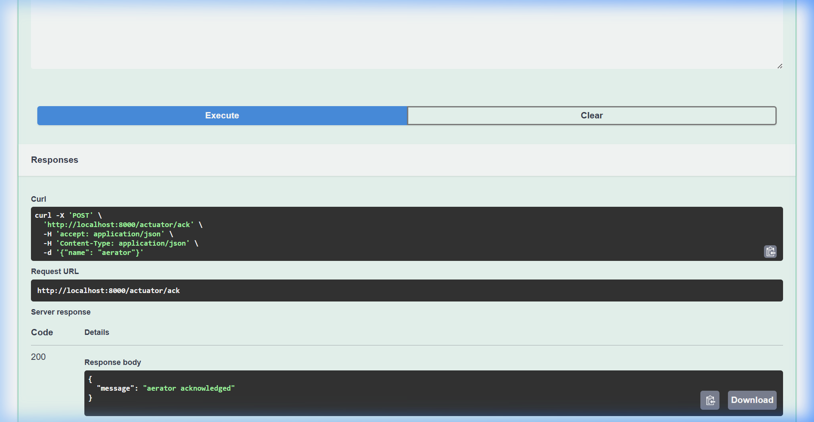

---

## 8. GET `/settings` — Konfigurasi Sistem

**Fungsi:** Menampilkan konfigurasi ambang batas sistem.

**Response:**
```json
{
  "doThreshold": 5,
  "phMin": 6.5,
  "phMax": 8.0,
  "tempMax": 30,
  "turbidityMax": 15,
  "waterLevelMax": 20,
  "iotEnabled": true,
  "refreshInterval": 5
}
```

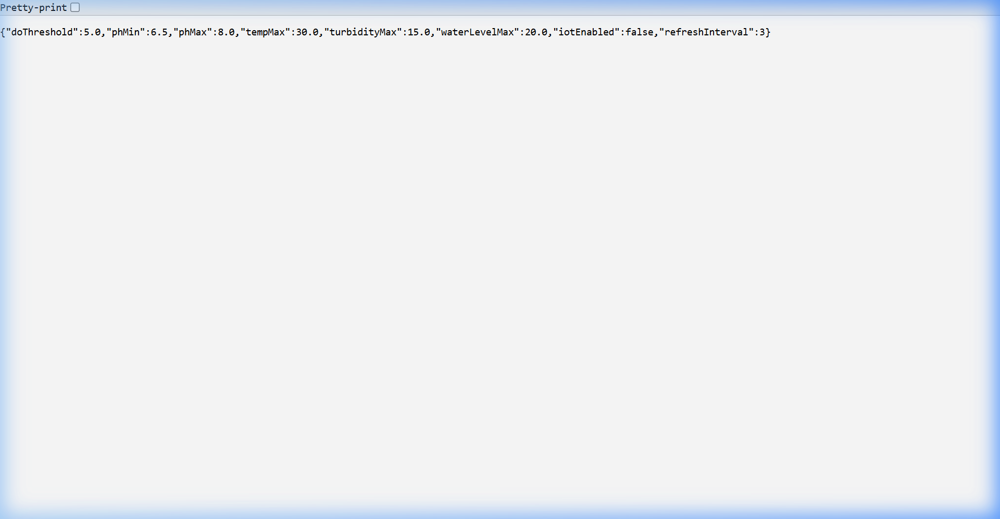

---

## 9. POST `/settings` — Update Konfigurasi

**Fungsi:** Memperbarui konfigurasi ambang batas dan parameter sistem.

**Request Body:**
```json
{
  "doThreshold": 5,
  "phMin": 6.5,
  "phMax": 8.0,
  "tempMax": 30,
  "turbidityMax": 15,
  "waterLevelMax": 20,
  "iotEnabled": true,
  "refreshInterval": 5
}
```

**Response:**
```json
{
  "message": "Settings updated"
}
```

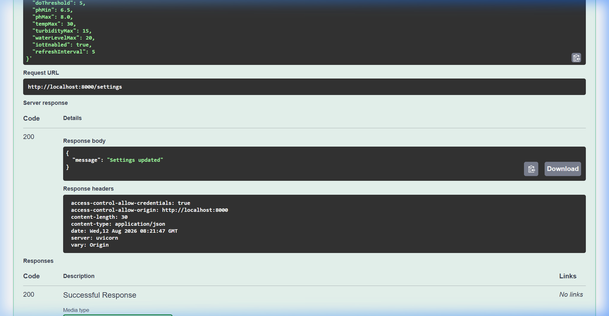

---

## 10. GET `/feeding-schedule` — Jadwal Pakan

**Fungsi:** Menampilkan jadwal pemberian pakan.

**Response:**
```json
{
  "feedingTime": "08:00",
  "interval": 6,
  "enabled": true
}
```

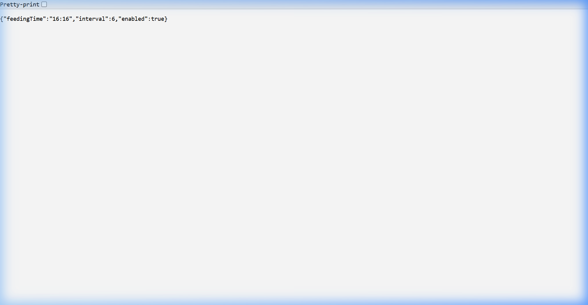

---

## 11. POST `/feeding-schedule` — Update Jadwal Pakan

**Fungsi:** Memperbarui jadwal pemberian pakan.

**Request Body:**
```json
{
  "feedingTime": "07:00",
  "interval": 8,
  "enabled": true
}
```

**Response:**
```json
{
  "message": "Feeding schedule updated"
}
```

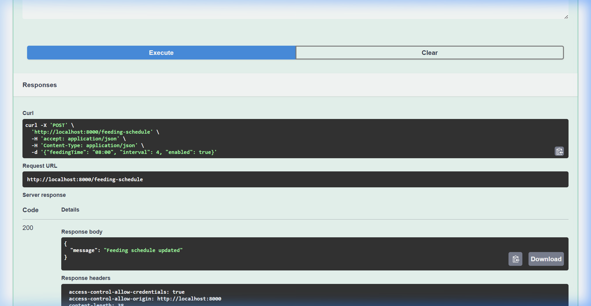

---

## 12. GET `/feeding-version` — Versi Jadwal Pakan

**Fungsi:** Menampilkan versi jadwal pakan untuk sinkronisasi.

**Response:**
```json
{
  "version": 0
}
```

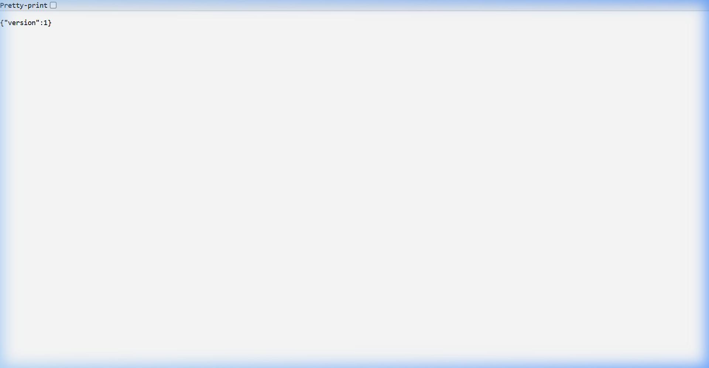

---

## 13. GET `/emails` — Daftar Email

**Fungsi:** Menampilkan daftar penerima notifikasi email.

**Response:**
```json
[]
```

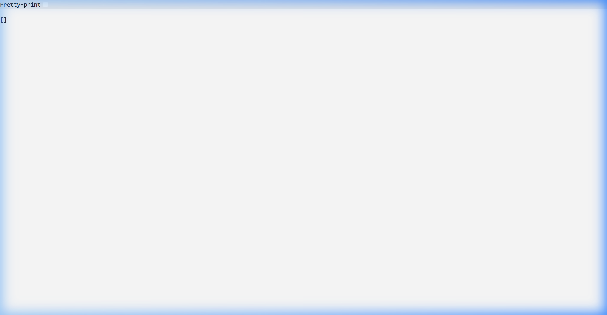

---

## 14. POST `/emails` — Tambah Email

**Fungsi:** Menambahkan alamat email penerima notifikasi.

**Request Body:**
```json
{
  "email": "test@aquaagent.com"
}
```

**Response:**
```json
{
  "message": "Email added"
}
```

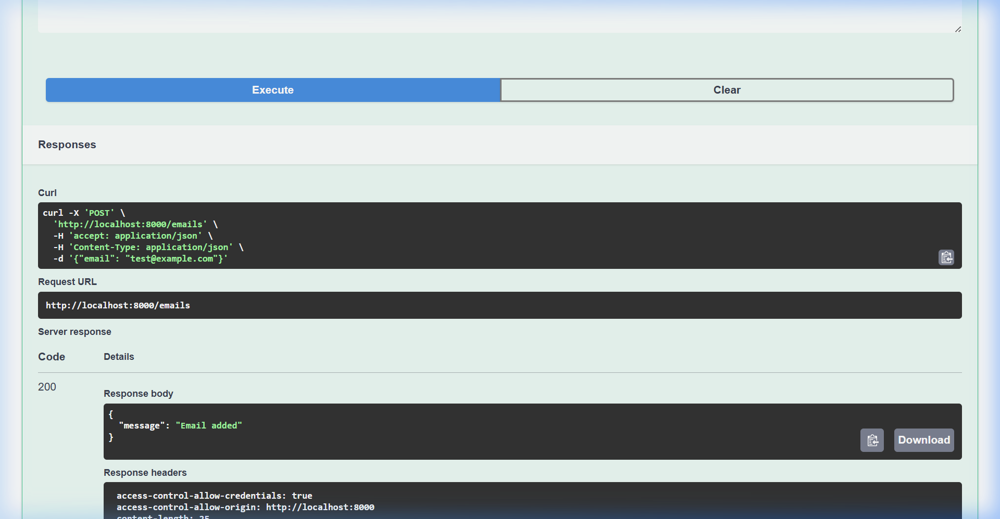

---

## 15. DELETE `/emails/{email}` — Hapus Email

**Fungsi:** Menghapus alamat email penerima notifikasi.

**Parameter:** `email = test@aquaagent.com`

**Response:**
```json
{
  "message": "Email removed"
}
```

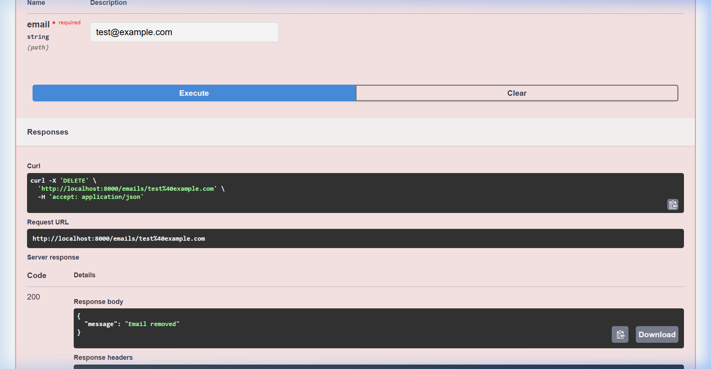

---

## 16. GET `/latest` — Analisis Terbaru

**Fungsi:** Menampilkan hasil analisis terbaru.

**Response:**
```json
{
  "mode": "Rule-Based + RF",
  "health_status": "Normal",
  "rf_confidence": 0.98,
  "sensor_data": {
    "temperature": 28.5,
    "do": 7.81,
    "ph": 7.2,
    "turbidity": 10.0,
    "water_level": 15.0,
    "hour": 14
  },
  "aerator": "OFF",
  "water_circulation": "OFF",
  "ph_neutralizer": "OFF",
  "buzzer": "OFF",
  "reason": "All sensor parameters are within normal range."
}
```

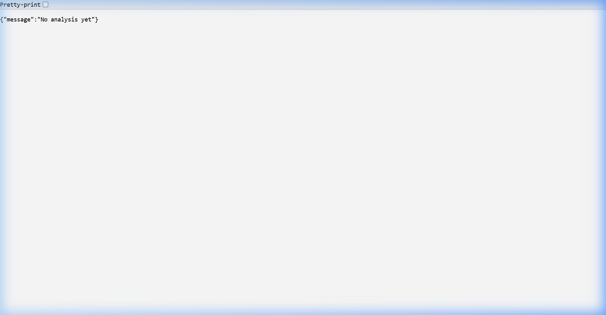

---

## 17. GET `/history` — Riwayat Pemantauan

**Fungsi:** Menampilkan riwayat hasil pemantauan yang tersimpan pada basis data.

**Response (contoh):**
```json
[
  {
    "id": 1,
    "timestamp": "2026-08-12 15:10:00",
    "temperature": 28.5,
    "do": 7.81,
    "ph": 7.2,
    "turbidity": 10.0,
    "water_level": 15.0,
    "health_status": "Normal"
  }
]
```

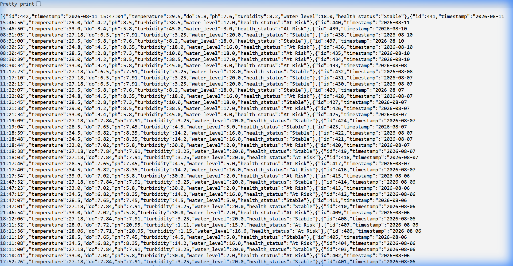

---

## Kesimpulan

Seluruh **17 endpoint** API AQUAAGENT telah berhasil diuji melalui Swagger UI dan semuanya mengembalikan **HTTP 200 OK** dengan response body yang sesuai dengan spesifikasi. Tidak ada error yang ditemukan selama proses pengujian.

### Detail Pengujian:
- **GET Endpoints (9 endpoint):** Semua berhasil mengembalikan data sesuai ekspektasi
- **POST Endpoints (7 endpoint):** Semua berhasil memproses request dan mengembalikan pesan konfirmasi
- **DELETE Endpoint (1 endpoint):** Berhasil menghapus data dan mengembalikan konfirmasi

### Catatan Khusus:
1. Endpoint `/analyze` memerlukan `iotEnabled: true` pada settings agar bisa menerima data dari source `"iot"`. Jika disabled, akan mengembalikan `{"success": false, "message": "IoT Receiver is disabled."}`
2. Endpoint `/actuator` secara otomatis mengeset `beep: true` setelah update, sebagai sinyal ke IoT device
3. Data yang dianalisis melalui `/analyze` otomatis tersimpan ke database dan bisa diakses via `/history`
